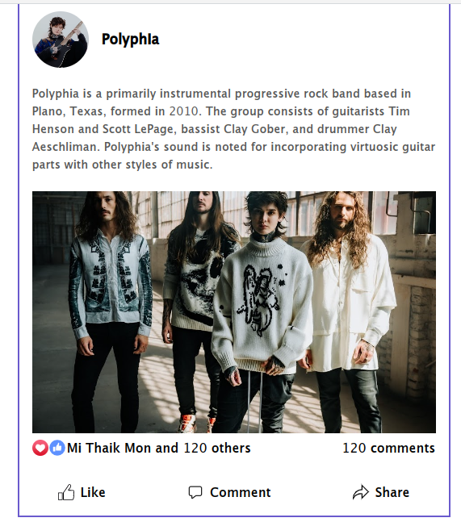

# Creating Facebook Post UI

## Template Code

## Usage

1. Open git bash

2. Change directory ( eg. Desktop )

3. Clone this repo to local machine  
   `git clone https://github.com/yezarniko/facebook_post_template.git`

4. Open code in Vscode

## Preview

